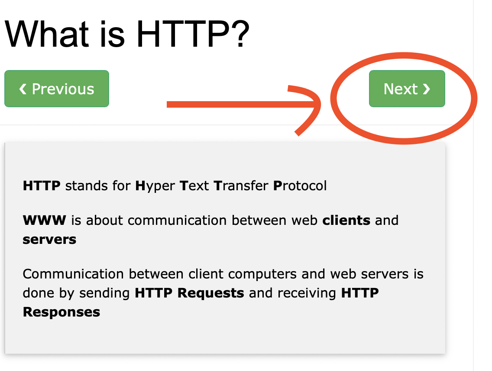
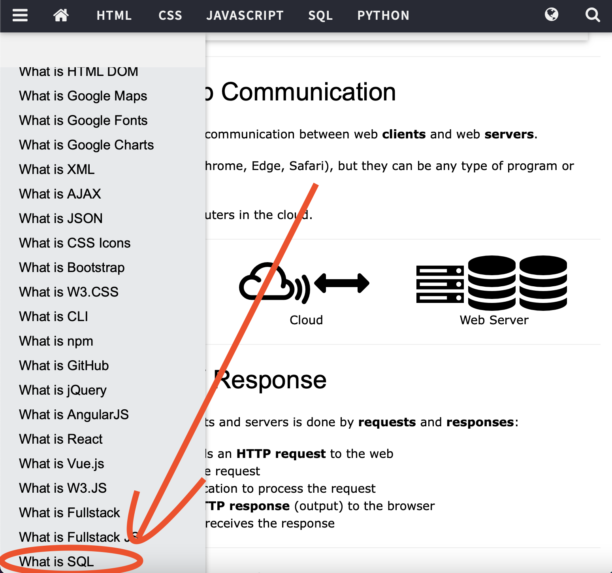
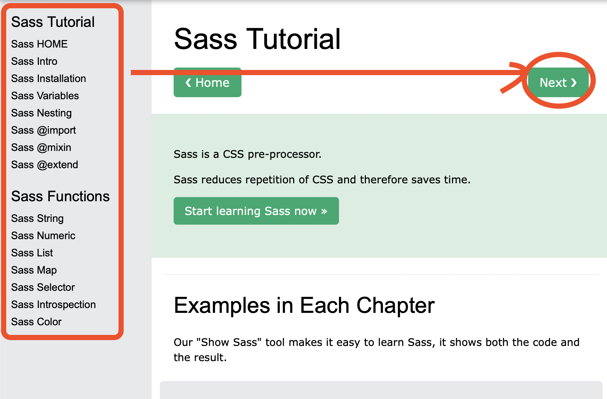

 

# 100days of Full Stack Web Dev 

__________
__________

### Before starting

**Make sure you update/add your title as "Participant" in 100days for duration of 3 months under the professional experience section on LikedIn. It's absolutely fine if you use "Participant" title in the volunteering section too.** 

 

### RULES 
Each day you will be sharing your progress as (example) Day 1/100 - Installing The tools and sharing what you learned and your experience either on LinkedIn or Twitter and tagging [our page](https://www.linkedin.com/company/100daysofficial)  
**Do not** forget to use #hashtags - 
- [#100daysofWebDev] 
- [#100days]
- [#100daysofficial]
- [#100daysoflearning]

 

  

This is essential for you as you get to keep a track of your progress and us to stick to our motto for democratizing free learning and increasing our reach so more students get to use these curated pathways to kickstart their journey in various fields. 

**Don't Forget to read a little message at the end for everyone by the Founder of 100days.**

________
____________

 
 
 
 

**Also this a personal suggestion (No promotion). All the video or most videos in the links used throughout are on Youtube. To avoid those annoying ads try and use [Brave](https://brave.com) browser, it does not display Ads on any of the videos and is great for surfing videos on Youtube.**

# Day 1 - Understanding Basics and Installing the Tools 

First of all welcome everyone who has taken this pathway! Before getting started the traditional way, Let's first understand the terms used in Full Stack and understand a few basics before getting started. 
 The first day itself might seem long, but bear with us a little. It's not that hard.

 

1. What is web development: How websites work, front-end vs back-end ? 
   * How do websites work? All websites, at their most basic, are just a bunch of files that are stored on a computer called a server. This server is connected to the internet. You can then load that website through a browser (like Chrome, Firefox, or Safari) on your computer or your phone. Your browser is also called the client in this situation. Anything that you can access in your browser is something that a web developer built. Some examples are small business websites and blogs on the simpler side, all the way up to very complex web apps like AirBnb, Facebook and Twitter.
    

   * What’s the difference between front-end and back-end? 
   Front end” means that you’re dealing mainly with the client side. It’s called the “front end” because it’s what you can see in the browser. Conversely, the “back end” is the part of the website that you can’t really see, but it handles a lot of the logic and functionality that is necessary for everything to work.

2. Basic front-end 
   * HTML HTML, or HyperText Markup Language, is the foundation of all websites. It’s the main file type that is loaded in your browser when you look at a website. The HTML file contains all the content on the page, and it uses tags to denote different types of content.
    

   * CSS 
CSS, or Cascading Style Sheets, lets you style that HTML content so it looks nice and fancy. You can add colors, custom fonts, and layout the elements of your website however you want them to look. You can even create animations and shapes with CSS!

   * JavaScript 
JavaScript is a programming language that was designed to run in the browser. Using JavaScript, you can make your website dynamic, meaning it will respond to different inputs from the user, or other sources.

3. Basic back-end 
  * The core concern of back-end developers is creating applications that can find and deliver data to the front end. 
  * Many of them use reliable enterprise-level databases like Oracle, Teradata, Microsoft SQL Server, IBM DB2, EnterpriseDB and SAP Sybase ASE. There’s also a number of other popular databases including MySQL, NoSQL and PostgreSQL.

**Read**
Now that we understand the term "Full Stack better", here's a link to one of the best resources out there to understand each and every term that will be used in Web Development. [Link](https://www.w3schools.com/whatis/whatis_http.asp) 

 
 

 
 

**Click next until you reach SQL**

 

  

Once done with giving all of that ☝🏼 a read. Let's talk about the IDE we will use..

- [Vs Code](https://code.visualstudio.com/download)

Single handedly the best code editor, does not need extra setup for handling front end at all. You are free to use Sublime Text OR any other code editor for that matter too. Given that we will be focusing on the languages, IDE's wont really matter.

 
 

# Day 2 to 20  - HTML AND CSS

I feel one of the best ways to learn coding languages is to rather do the implementation side by side with learning rather than just reading it like high school biology. Let's get started without wasting any time. 

- [HTML Full Course - Building a website](https://www.youtube.com/watch?v=pQN-pnXPaVg&list=PLWKjhJtqVAbnSe1qUNMG7AbPmjIG54u88&index=3)- 2 Hours 
This course is great for starting, it's easy its simple. Also don't rush to understand things in one go. The next video is of 11 Hours that will definitely cover everything. I would request you'll to just treat this as a video lessons and remember the things your do not  understand. The next video definitely will help you to clear your doubts.
  

- [Learn HTML5 AND CSS](https://www.youtube.com/watch?v=mU6anWqZJcc&list=PLWKjhJtqVAbnSe1qUNMG7AbPmjIG54u88&index=1)- 11 Hours  Amazing amazing..... Literally Freecodecamp is better than anything else out there in a few courses, WebDev is definitely one of them. 
This course starts from the very basics to installing vscode, using and leveraging inspect element tool. 11 Hours for this is worth it. 

- [Introduction To Responsive Web Design - Bootstrap](https://www.youtube.com/watch?v=srvUrASNj0s)- 4 Hours  Responsive design with HTML AND CSS.

- [Sass (CSS) with Portfolio building project](https://www.youtube.com/watch?v=srvUrASNj0s)- 2 Hours  
   * What is Sass? 
   Sass is a CSS pre-processor. Sass reduces repetition of CSS and therefore saves time. Read this before the video to get a better understanding of Saas. 
    

  

- [Practice Projects](https://www.geeksforgeeks.org/top-10-projects-for-beginners-to-practice-html-and-css-skills/) - 2 Hours each day  The link has 10 projects for beginners and it will help your practice your HTML and CSS. Folks, do not let this one slide. It's important that you do this by yourself, try best to not look at the code. 

 

### Schedule

So we have a lot to work with... yeah? Here...we are planning to utilize 2 hours from your precious 24 for HTML,CSS. The schedule is really light, Take it slow but try to dedicate at-least 2 hours everyday. (You will still be able to complete it even if you dont.)

|   Day/Days |      Hours                                    |
| -----------| -----------                                   |
|  2         |   HTML Full Course                            |
| 3 to 9     |   Learn HTML5 AND CSS                         |
| 12         |   Sass (CSS) with Portfolio building project] |
| 13 - 20    |   7 Projects atleast ( One everyday )         |

 
 

# Day 21 - 30  Java Script/ Vanilla JavaScript

The term "Vanilla" is used to refer to pure Javascript or in simpler words plain javascript with any additional libraries. 
 
If you know any other language such as C, C++, Java or Python then JavaScript should be no brainer for you guys. It's easy and clean to understand. Let's start.

- [Javascript from 0.](https://www.youtube.com/watch?v=PkZNo7MFNFg)- 3.5 Hours 
This course is an absolute beast to get started with, made for beginners to start right from scratch. 

JavaScript has no limits... not literally 😅, everything has a limit, But javascript is something that needs to be experimented with, you can make games, projects best designs. 

- [15 Javascript Projects](https://www.youtube.com/watch?v=3PHXvlpOkf4)- 8.5 Hour This 8.5 hour video is lengthy but it's great to gets hands on javascript with various projects covering all major topics. 

 

### Schedule

Folks the projects are important, make sure you do not miss out on/skip them. The schedule is stretched a little to make it easy and to implement everything beside the videos. Make sure you implement everything. 

|   Day/Days |      Hours                                    |
| -----------| -----------                                   |
| 21-23      |   Javascript from 0.                          |
| 24-30      |   15 Javascript Projects                      |

 
 

# Day 31 -   React JS

