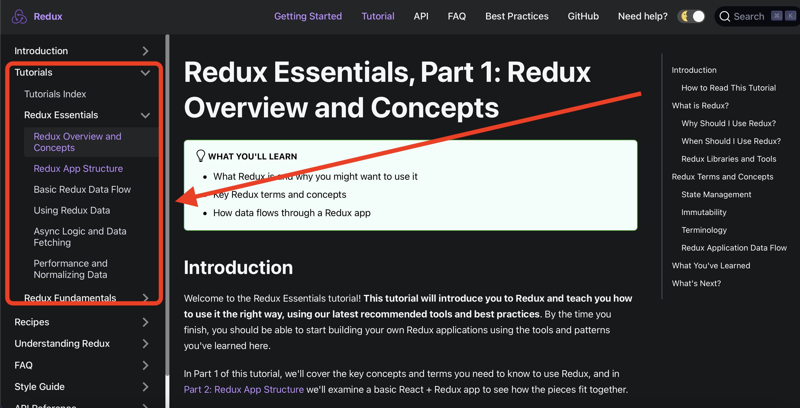

 

# 💯 [100days](https://100days.codes){:target="_blank"} of Full Stack Web Dev 

 

## 📍 Before starting

**✔️ Make sure you update/add your title as "Participant" in 100days for a duration of 3 months under the professional experience section on LinkedIn.. It's absolutely fine if you use "Participant" title in the volunteering section too.** 
 

**✔️ ⭐️ Star the repo? Cause why not 😅 😊** 

 

## 🏁 RULES 
Each day you will be sharing your progress as (example) Day 1/100 - Installing The tools and sharing what you learned and your experience either on LinkedIn or Twitter and tagging [our page](https://www.linkedin.com/company/100daysofficial){:target="_blank"}  
**Do not** forget to use #hashtags - 
- [#100daysofWebDev] 
- [#100days]
- [#100daysofficial]
- [#100daysoflearning]

 

  

**This is essential for you as you get to keep a track of your progress and us to stick to our motto for democratizing free learning and increasing our reach so more students get to use these curated pathways to kickstart their journey in various fields.**
 

**Also this a personal suggestion (No promotion). All the video or most videos in the links used throughout are on Youtube. To avoid those annoying ads try and use [Brave](https://brave.com){:target="_blank"} browser, it does not display Ads on any of the videos and is great for surfing videos on Youtube.**

 
 
 
 

# ⚠️ Prerequisite - Version Control Systems and Git

**Before we start Day 1, This pathway assumes that you are aware of git i.e version control systems. So if you arent familiar with Git and how it works, let's get you started right away.**

- [Version Control System Introduction](https://www.youtube.com/watch?v=zbKdDsNNOhg){:target="_blank"}

- [Git and Github Crash Course](https://www.youtube.com/watch?v=SWYqp7iY_Tc){:target="_blank"}

- [Learn Git in 20 minutes](https://youtu.be/Y9XZQO1n_7c?t=21){:target="_blank"}

 
 
 

# ✅ Day 1 - Understanding Basics and Installing the Tools 

First of all welcome everyone who has taken this pathway! Before getting started the traditional way, Let's first understand the terms used in Full Stack and understand a few basics before getting started. 
 The first day itself might seem long but bear with us a little. It's not that hard.

 

1. What is web development: How websites work, front-end vs back-end ? 
   * How do websites work? All websites, at their most basic, are just a bunch of files that are stored on a computer called a server. This server is connected to the internet. You can then load that website through a browser (like Chrome, Firefox, or Safari) on your computer or your phone. Your browser is also called the client in this situation. Anything that you can access in your browser is something that a web developer built. Some examples are small business websites and blogs on the simpler side, all the way up to very complex web apps like AirBnb, Facebook and Twitter.
    

   * What’s the difference between front-end and back-end? 
   Front end” means that you’re dealing mainly with the client side. It’s called the “front end” because it’s what you can see in the browser. Conversely, the “back end” is the part of the website that you can’t really see, but it handles a lot of the logic and functionality that is necessary for everything to work.

2. Basic front-end 
   * HTML HTML, or HyperText Markup Language, is the foundation of all websites. It’s the main file type that is loaded in your browser when you look at a website. The HTML file contains all the content on the page, and it uses tags to denote different types of content.
    

   * CSS 
CSS, or Cascading Style Sheets, lets you style that HTML content so it looks nice and fancy. You can add colors, custom fonts, and layout the elements of your website however you want them to look. You can even create animations and shapes with CSS!

   * JavaScript 
JavaScript is a programming language that was designed to run in the browser. Using JavaScript, you can make your website dynamic, meaning it will respond to different inputs from the user, or other sources.

3. Basic back-end 
  * The core concern of back-end developers is creating applications that can find and deliver data to the front end. 
  * Many of them use reliable enterprise-level databases like Oracle, Teradata, Microsoft SQL Server, IBM DB2, EnterpriseDB and SAP Sybase ASE. There’s also several popular databases including MySQL, NoSQL and PostgreSQL.

**Read**
Now that we understand the term "Full Stack better", here's a link to one of the best resources out there to understand every term that will be used in Web Development. [Link](https://www.w3schools.com/whatis/whatis_http.asp){:target="_blank"} 

 
 

 
 

**Click next until you reach SQL**

 

  

Once done with giving all of that ☝🏼 a read. Let's talk about the IDE we will use..

- [Vs Code](https://code.visualstudio.com/download)

Single-handedly the best code editor, does not need extra setup for handling the front end at all. You are free to use Sublime Text OR any other code editor for that matter too. Given that we will be focusing on the languages, IDE's won't matter.

 
 

# ✅ Day 2 to 20  - HTML AND CSS

I feel one of the best ways to learn coding languages is to rather do the implementation side by side with learning rather than just reading it like high school biology. Let's get started without wasting any time. 

- [HTML Full Course - Building a website](https://www.youtube.com/watch?v=pQN-pnXPaVg&list=PLWKjhJtqVAbnSe1qUNMG7AbPmjIG54u88&index=3)- 2 Hours 
This course is great for starting, its easy its simple. Also, don't rush to understand things in one go. The next video is of 11 Hours that will definitely cover everything. I would request you'll to just treat this as a video lesson and remember the things you do not  understand. The next video definitely will help you to clear your doubts.
  

- [Learn HTML5 AND CSS](https://www.youtube.com/watch?v=mU6anWqZJcc&list=PLWKjhJtqVAbnSe1qUNMG7AbPmjIG54u88&index=1)- 11 Hours  Amazing amazing..... Literally, Freecodecamp is better than anything else out there in a few courses, WebDev is definitely one of them. 
This course starts from the very basics to installing vscode, using and leveraging inspect element tool. 11 Hours for this is worth it. 

- [Introduction To Responsive Web Design - Bootstrap](https://www.youtube.com/watch?v=srvUrASNj0s)- 4 Hours  Responsive design with HTML AND CSS.

- [Sass (CSS) with Portfolio building project](https://www.youtube.com/watch?v=srvUrASNj0s)- 2 Hours  
   * What is Sass? 
   Sass is a CSS pre-processor. Sass reduces the repetition of CSS and therefore saves time. Read this before the video to get a better understanding of Saas. 
    

  

- [Practice Projects](https://www.geeksforgeeks.org/top-10-projects-for-beginners-to-practice-html-and-css-skills/) - 2 Hours each day  The link has 10 projects for beginners and it will help your practice your HTML and CSS. Folks, do not let this one slide. It's important that you do this by yourself, try your best to not look at the code. 

 

### 🗓 Schedule

So we have a lot to work with... yeah? Here...we are planning to utilize 2 hours from your precious 24 for HTML, CSS. The schedule is really light, Take it slow but try to dedicate at least 2 hours every day. (You will still be able to complete it even if you do not.)

|   Day/Days |      Hours                                    |
| -----------| -----------                                   |
|  2         |   HTML Full Course                            |
| 3 to 9     |   Learn HTML5 AND CSS                         |
| 12         |   Sass (CSS) with Portfolio building project] |
| 13 - 20    |   7 Projects at least ( One every day )         |

 
 

# ✅ Day 21 - 30  Java Script/ Vanilla JavaScript

The term "Vanilla" is used to refer to pure Javascript or in simpler words plain javascript with any additional libraries. 
 
If you know any other language such as C, C++, Java or Python then JavaScript should be no brainer for you guys. It's easy and clean to understand. Let's start.

- [Javascript from 0.](https://www.youtube.com/watch?v=PkZNo7MFNFg)- 3.5 Hours 
This course is an absolute beast to get started with, made for beginners to start right from scratch. 

JavaScript has no limits... not literally 😅, everything has a limit, But javascript is something that needs to be experimented with, you can make games, projects best designs. 

- [15 Javascript Projects](https://www.youtube.com/watch?v=3PHXvlpOkf4)- 8.5 Hour This 8.5 hour video is lengthy but its great to get hands-on javascript with various projects covering all major topics. 

 

### 🗓 Schedule

Folks the projects are important, make sure you do not miss out on/skip them. The schedule is stretched a little to make it easy and to implement everything along with the videos. Make sure you implement everything. 

|   Day/Days |      Hours                                    |
| -----------| -----------                                   |
| 21-23      |   Javascript from 0.                          |
| 24-30      |   15 Javascript Projects                      |

 
 

# 🥳 Day 31 - Take a Day off 😄 🙌🏼

 
 

# ✅ Day 32 TO 36  JS AJAX, JSON, WeB APIS

Now let's start with understanding AJAX followed by understanding Json files and APIS. We will use W3schools and a video here to clear our concepts.

- [JS AJAX](https://www.w3schools.com/js/js_ajax_intro.asp)

- [JS JSON](https://www.w3schools.com/js/js_json_intro.asp)

- [JS Web APIs](https://www.w3schools.com/js/js_api_intro.asp)

- [JSON AND AJAX Tutorial](https://www.youtube.com/watch?v=rJesac0_Ftw)- 40 mins 
The video is hardly 40 mins but make sure you use implement the examples side by side. 

- [API'S for beginners](https://www.youtube.com/watch?v=GZvSYJDk-us) - 2.5 Hours 
 Best one out there to understand the use of API'S.. If you want to know how is Js involved in all this.. wait till the end of the video. 

 

### 🗓 Schedule

It's all reading, can't force you to sit for 4 hours and finish it in a go right ?

|   Day/Days |      Hours                                    |
| -----------| -----------                                   |
|   32-33    |    AJAX JSON WeB APIS - W3schools             |
|    34      |    JSON AND AJAX Tutorial                     |
|    35-36   |    API'S                                      |

 
 

# ✅ Day 37 to 41 -  jQuery

jQuery is a fast, small, and feature-rich JavaScript library. It makes things like HTML document traversal and manipulation, event handling, animation, and Ajax much simpler with an easy-to-use API that works across a multitude of browsers. With a combination of versatility and extensibility, jQuery has changed the way that millions of people write JavaScript. (Source: jQuery.com)  

Read this document to understand jQuery API. [Link](https://api.jquery.com). 

- [jQuery](https://www.freecodecamp.org/learn/front-end-libraries/#jquery) - 18 courses  Click on the link wait for a few seconds, it will directly take you to jQuery section 18 short courses are there, easily doable in 5 days.
 

### 🗓 Schedule

It's all reading, can't force you to sit for 4 hours and finish it in a go.

|   Day/Days |      Hours                                    |
| -----------| -----------                                   |
|   37-41    |    jQuery course on Freecodecamp              |

 
 

# ✅ Day 42 to 55 -  React JS

**Read [this](https://www.framer.com/blog/posts/react-vs-vanilla-js/) article to understand the difference between React and Vanilla/Plain Js.**  

- [React Tutorial](https://reactjs.org/tutorial/tutorial.html)- 2-3 Hours

- [React Full Course](https://www.youtube.com/watch?v=4UZrsTqkcW4)- 10 Hours 

### 🗓 Schedule

The schedule is kept super light you will hardly sit for 1 hour every day, but make sure you are implementing them too while watching the videos.

|   Day/Days |      Hours                   |
| -----------| -----------                  |
|   42       |      React Tutorial]         |
|   43-55    |      React JS                |

 
 

# ✅ Day 56 to 66 -  Redux

One of the best ways to learn about something is to get the info from the official site itself. But to sum it all up - Redux is a predictable state container for JavaScript apps. It helps you write applications that behave consistently, run in different environments (client, server, and native), and are easy to test. On top of that, it provides a great developer experience, such as live code editing combined with a time-traveling debugger. (Source: redux.js.org) 

- [Tutorial - Reading](https://redux.js.org/tutorials/index)- 3 Hours  Follow the order shown in the picture. The tutorial follows top to down approach explaining Redux in the correct order.

 
 

- [Redux Fundamentals](https://egghead.io/courses/fundamentals-of-redux-course-from-dan-abramov-bd5cc867)- 2 Hours  This course from the creator of Redux is free and should get you started with understanding redux better. 

- [Redux Crash Course](https://www.youtube.com/watch?v=93p3LxR9xfM) - 1 Hour 

- [Redux Exercise on FreeCodecamp](https://www.freecodecamp.org/learn/front-end-libraries/#react-and-redux)- Self paced

### 🗓 Schedule

|   Day/Days |      Hours                   |
| -----------| -----------                  |
|   56-57    |      Redux Tutorial          |
|   58-59    |      Redux Fundamentals      |
|   60-66    |      Freecodecamp's Exercise |

 
 

# ✅ Day 66 to 70 -  Node.js, NPM, Rest API's, MongoDb, Docker, Angular 

Node.js before was used as a back-end, but looking at the trend it shifted to the front end because of its functionalities and one the best one being Node Package Manager (NPM) which is used to manage dependencies of projects.  

- [Node Official Guide](https://nodejs.org/en/docs/guides/) 

Now the title was quite big. What if I told you there is a video out there that covers all those topics in a single video? 

- [Node JS Complete](https://www.youtube.com/watch?v=RLtyhwFtXQA&list=RDCMUC8butISFwT-Wl7EV0hUK0BQ&index=11)- 3 Hours br>

- [Node.js Full Course](https://www.youtube.com/watch?v=JnvKXcSI7yk) - 7 Hours  
Covers NPM, Rest API's, MongoDB, Docker, Angular. (MEAN Stack)

### 🗓 Schedule

|   Day/Days |      Hours                   |
| -----------| -----------                  |
|   66       |      Node JS Complete        |
|   66-67    |      Node.js Full Course     |

 
 

# BACK END 
Now that we have completed our front end path, let's come to back end. What exactly is needed (bare minimum) for backend?

1. Good knowledge about a programming language in which you can write HTTP servers. Examples: C#, Java, Node, PHP, Python, etc. (there are many!)

2. Manage to host using cPanel (traditional) or using bash terminal (cloud hosting/traditional)

3. Working with Version Control Systems (VCS) like git for managing and deploying builds

One of the best parts that you do not realize is that we have already covered JavaScript which the ranked #1 as a backend programming language. If you want to still learn another language you are most welcome to.

 
 

# ✅ Day 70 to 74 - SQL 

SQL is a goto and a must when it comes to database management systems. You can also use NoSQL too. 

- [SQL Complete Course](https://www.youtube.com/watch?v=HXV3zeQKqGY&t=1s)

### 🗓 Schedule

|   Day/Days |      Hours                   |
| -----------| -----------                  |
|   70-74    |      SQL                     |

 
 

# ✅ Day 75 to 78 - NGINX 

What is N-GIN-X ? 
Click [here](https://www.youtube.com/watch?v=JKxlsvZXG7c) to understand it in 100 seconds. 

This is a skill that is a must have if you really want to ace back end. It is so much in demand in the web industry that their own official page charges for its courses. 

- [NGINX - Article](https://kinsta.com/knowledgebase/what-is-nginx/)  - 10 Minutes 
- [NGINX Tutorial](https://www.youtube.com/watch?v=GGS6KMRbONo&t=9280s) - 3 Hours  
**OR** /  **both** Either use one or both. 
- [NginX Crash Course ](https://www.youtube.com/watch?v=hcw-NjOh8r0&t=15s) - 2 Hours

### 🗓 Schedule

|   Day/Days |      Hours                   |
| -----------| -----------                  |
|   75-76    |     NGINX Tutorial           |
|   77-78    |      NGINX Crash Course      |

 
 

# ✅ Day 79 to 85 - Deployment 

Deployment and the services offered by the companies, THERE'S SO MANY! I have compiled a list of tbe best resources to make you understand how all of it works overall. Also if you have already hosted your own website online using any of the services like netlify or digital ocean or azure or aws, you already know most of it!  

- [Deploying a Web App with Docker & Github Actions][https://www.youtube.com/watch?v=JsOoUrII3EY&t=0s] - Part 1 - 25 Mins

- [Deploying a Web App to Digital Ocean with Docker & Nginx][https://www.youtube.com/watch?v=hf8wUUrGCgU] - Part 2 - 43 Mins

- [Project - Building an Online Store](https://www.youtube.com/watch?v=JgwI22y_eFA) - 1 Hour  In this video focus on connecting cloud resources using React app. 

- [Deploying on Netlify](https://www.youtube.com/watch?v=bjVUqvcCnxM)- 22 Mins 
Ever heard of Netlify? It's one of the best one's out there and I hosted 100days.codes using on Netlify . It lets you deploy your builds directly from GitHub. It's crazy I know! 

- [Deploying Node.JS webstie on Heroku](https://www.youtube.com/watch?v=r2S89Hm1Uq0)- 8 Mins

- [E Commerce application deployment on Azure](https://www.youtube.com/watch?v=Bm5wJTQFzsE)- 2 Hours

**This is the only place in the whole course I will ask you to research a little on your own or if you are confident then take a few days off because the last 15 Days are all about full scale projects.** 

### 🗓 Schedule

|   Day/Days |      Hours                         |
| -----------| -----------                        |
|   79-80    | Deploying with Docker Part 1 & 2   |
|   81       | Project - Building an Online Store |
|   82       | Deploying on Netlify               |
|   83       | Deploying Node.JS website on Heroku|
|   84       |E Commerce application - Azure      |

 
 

# 🥳 Day 85 - Take a Day off 😄 🙌🏼

 
 

# 💯🔥 Day 86 to 100 - Projects 

**Remember** you may find of literally every project online, but that does not mean that you need to copy and paste everything..always remember as to why you took the 100days #challenge in the first place. 🔥

 

### Codepen projects with JS HTML CSS

**Don't skip these...**
_________________________
- [JavaScript Clock](https://codepen.io/codifiedconcepts/pen/bwgxRq)

- [Javascript Tip Calculator](https://codepen.io/cphemm/pen/reNwWd)

- [Animated Nav Toggle & Menu](https://codepen.io/cphemm/pen/reNwWd)

- [CodePen Home Interactive Map with Jquery BY Sara B.](https://codepen.io/aomyers/pen/LWOwpR)

- [CodePen Home Pickle Rick Maze Game](https://codepen.io/TheCodeDepository/pen/jKBaoN?page=8)

- [Happy bouncing balls](https://codepen.io/b4rb4tron/pen/wjyXNJ)

- [CodePen Home I2Djs - SVG - Infinite rainbow](https://codepen.io/nswamy14/pen/MXoZjg?page=1&)

- [TO-do list](https://codepen.io/JohnPaulFich/pen/MXmzzM)
____________________________

 

### Advanced Projects 
 

The projects listed below are open-source projects so you can definitely study them and use the code....who knows you might end up with something new of your own? 😎 

- [PRETTIER](https://github.com/prettier/prettier) - Code formatter.

- [Terminalizer](https://terminalizer.com) - Make gifs of your code in terminal for tutorials for blogs. 

- [NANO ID](https://zelark.github.io/nano-id-cc/) - Random number generator 

- [Web pack Monitor](http://webpackmonitor.com) - The Ultimate Optimization Tool For Modern Web Development

- [Map talk](https://maptalks.org/index.html) - An open-source javascript library for integrated 2D/3D maps.

- [Parcel](https://parceljs.org) - Blazing fast, zero configuration web application bundler

- [Tone.js](https://tonejs.github.io) - Tone.js is a Web Audio framework for creating interactive music in the browser.

______________________________________

### 🚩 Important projects with videos 

**Do not skip these even if it takes extra 20 days :)**

- [Build a social media app (MERNG Stack)](https://www.youtube.com/watch?v=n1mdAPFq2Os)

- [Instagram Clone](https://www.youtube.com/watch?v=1hPgQWbWmEk&list=RDCMUC8butISFwT-Wl7EV0hUK0BQ&index=3)

- [Learn MERN Stack](https://www.youtube.com/watch?v=7CqJlxBYj-M&list=RDCMUC8butISFwT-Wl7EV0hUK0BQ&index=4)

- [Landing page using HTML CSS AND JS](https://www.youtube.com/watch?v=aoQ6S1a32j8&list=RDCMUC8butISFwT-Wl7EV0hUK0BQ&index=19)

- [Mern Stack Course - Convert backend to serverless](https://www.youtube.com/watch?v=mrHNSanmqQ4&list=RDCMUC8butISFwT-Wl7EV0hUK0BQ&index=28)

- [Free Official MongoDB Courses](https://university.mongodb.com/courses/catalog)

 

### 🗓 Schedule

|   Day/Days |      Hours                                                     |
| -----------| -----------                                                    |
|   86-90    | Select any 5 Codepen projects that you like                    |
|   90-100   | Important projects with videos                                 |
|Extra days  |  If left with extra days then - Advanced Projects              |

______________________________

 
 

## A little Message.

Hey Folks! The100!  
Thanks for being among the first ones to contribute to our journey and letting us be a part of yours.

Heartfelt thanks ❤️ If you have stayed with us for 100days. We love your dedication and thanks for being a contributor to our mission: “Democratizing free learning”. 

We will soon be setting up a form for your details and so that we can send you a cool certificate for your dedication, commitment and hard work throughout.

Utkarsh
Founder 100days